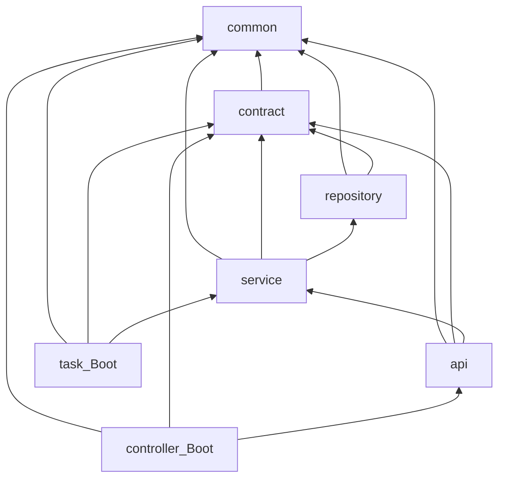

---

name: Scaffold Align Boot35
overview: 按 [doc/01-脚手架.md](doc/01-脚手架.md) 对齐现有半成品：降级到 Spring Boot 3.5.x + JDK 21，补齐 api/修正 service 目录、task 独立启动、Redis/PageHelper，并用 Compose + 连通性测试验证 MySQL/Redis 与服务启动。
todos:

- id: align-versions
content: 根 POM：Boot 3.5.x、JDK 21、MyBatis 3.0.5、PageHelper 2.1.1、api 模块、Actuator refresh
status: in_progress
- id: fix-modules
content: core→service 重命名；新建 api；controller 改依赖 api；task 独立 Boot 应用
status: pending
- id: redis-mysql-config
content: compose 加 Redis；yml/.env.example/README 配置与启动说明
status: pending
- id: connectivity-verify
content: Testcontainers MySQL/Redis 连通测试 + compose 下启动验收 ping/health
status: pending
isProject: false

---

# 脚手架对齐计划（Spring Boot 3.5.x + JDK 21）

## 现状与目标差距

已有：git / LICENSE / `.gitignore` / README、部分模块骨架、MySQL Compose、controller 可 contextLoads（H2）。

需对齐文档：

| 项          | 现状                                      | 目标                                 |
| ---------- | --------------------------------------- | ---------------------------------- |
| Boot / JDK | 4.0.7 / 17                              | **3.5.x / 21**                     |
| 模块         | 缺 `api`；`service` 目录误为 `core`           | 7 模块完整依赖图                          |
| task       | 库模块，被 controller 依赖                     | **独立 Boot 应用**，只依赖 service         |
| 依赖         | 无 Redis / PageHelper；MyBatis 4.x（Boot4） | MyBatis 3.0.x + PageHelper + Redis |
| 验证         | 仅 H2                                    | MySQL/Redis 连通 + 真实启动              |

## 目标模块依赖

职责约定（本阶段只搭骨架，不做业务功能）：

- **controller**：HTTP、鉴权解析占位、响应/`ApiResult`、异常处理；依赖 **api**，**不**依赖 task
- **api**：面向业务的用例编排（实现 contract 中的业务接口）
- **service**：可复用领域服务拆分（供 api / task 共用）
- **task**：独立进程，定时任务；只依赖 **service**
- **repository / contract / common**：持久化、DTO/接口、公共类型

版本统一只在根 [pom.xml](pom.xml) 的 `dependencyManagement` / `properties`；各模块仍保留自身 `pom.xml`（仅声明依赖坐标、不写版本）。文档中「不在各模块独立写 pom」按此理解。

## 1. 技术栈降级与版本锁定

改根 [pom.xml](pom.xml)：

- `spring-boot-starter-parent` → **3.5.x**（取当前 3.5 最新 patch，如 3.5.4+）
- `java.version` → **21**
- `mybatis-spring-boot.version` → **3.0.5**（Boot 3.2–3.5 线；现有 4.1.0 属 Boot 4）
- 新增 `pagehelper-spring-boot-starter` **2.1.1**（对齐 Boot 3.5）
- 新增内部模块 `flydeer-struct-mind-api` 到 `<modules>` 与 `dependencyManagement`
- Actuator「热更新配置」：保留 `spring-boot-starter-actuator`；引入 `spring-cloud-context`（或对应 Boot 3.5 BOM 兼容版）暴露 `/actuator/refresh`，并在配置中 `management.endpoints.web.exposure.include` 增加 `refresh`（本阶段不做 Config Server）

Controller 模块依赖从 Boot 4 命名改回 Boot 3：

- `spring-boot-starter-webmvc` → `spring-boot-starter-web`
- `spring-boot-starter-*-test` 碎片 → 统一 `spring-boot-starter-test`
- Redis：`spring-boot-starter-data-redis`（放在 repository 或 common 侧由 service/controller 传递依赖；推荐 **repository 不引 Redis**，在 **service** 或 **common 配置模块** 引入——本阶段放 **service** + controller/task 的 `application.yml` 配置）

## 2. 模块结构修正

1. 将目录 [flydeer-struct-mind-core](flydeer-struct-mind-core) **重命名**为 `flydeer-struct-mind-service`（与根 `<module>` 一致）；修正 `package-info` 包名与路径一致（`com.flydeer.structmind.service`）
2. 新建 **flydeer-struct-mind-api**
  - 依赖：common、contract、service
  - 包：`com.flydeer.structmind.api`（`package-info` + 空实现骨架即可）
3. 调整 [flydeer-struct-mind-controller/pom.xml](flydeer-struct-mind-controller/pom.xml)
  - 依赖改为 **api**（去掉直接依赖 service、**去掉 task**）
4. 将 [flydeer-struct-mind-task](flydeer-struct-mind-task) 升为独立 Boot 应用
  - 增加 `@SpringBootApplication` 主类、`application.yml`、`spring-boot-maven-plugin`
  - 依赖保持 service（不依赖 api）
  - 端口与 controller 错开（如 **8081**）
5. repository：增加 PageHelper；保留 MySQL driver
6. 清理根目录残留单模块源码（若仍存在 `src/main/java/...FlydeerStructMindServerApplication.java`）

## 3. MySQL / Redis 安装与配置

扩展 [compose.yaml](compose.yaml)：

- 保留 MySQL 8.4（现有 `struct_mind` 用户/库）
- 新增 **Redis**（如 `redis:7`，端口 6379，healthcheck）

更新配置：

- [application.yml](flydeer-struct-mind-controller/src/main/resources/application.yml)：`spring.data.redis.host/port`；PageHelper 合理默认（`helper-dialect: mysql`）
- task 的 `application.yml`：同样的 datasource + redis（任务进程也需连库/缓存时）
- [.env.example](.env.example)：补充 `REDIS_HOST` / `REDIS_PORT`
- README：JDK 21、Boot 3.5、api/task 双入口启动说明

本地「安装」路径：**Docker Compose**（不强制本机原生安装 MySQL/Redis）。

## 4. 连通性测试与启动验收

在 controller（及必要时 task）增加测试：

1. **保留**现有 H2 `contextLoads` 作为快速单测（`application-test.yml`）
2. **新增** MySQL + Redis 连通性集成测试（优先 **Testcontainers**，避免依赖本机已起服务）：
  - 能拿到 JDBC Connection / 执行 `SELECT 1`
  - Redis `PING` → `PONG`
3. 手动验收：
  - `docker compose up -d`
  - `./mvnw -pl flydeer-struct-mind-controller -am spring-boot:run`
  - `curl /api/v1/ping`、`/actuator/health`（health 中 db/redis 为 UP）
  - 可选：启动 task 模块确认独立进程起来

验收标准：全模块 `./mvnw clean verify` 通过；Compose 下 controller 可启动且 ping/health 正常。

## 5. 本阶段明确不做

- 业务 API、鉴权实现、真实定时任务逻辑、Flyway 业务表
- Config Server / 完整 Spring Cloud 栈（仅 refresh 所需最小依赖）

## 关键文件

- [pom.xml](pom.xml) — 版本与模块清单
- [flydeer-struct-mind-core](flydeer-struct-mind-core) → rename service；新建 api；改造 task/controller POM 与配置
- [compose.yaml](compose.yaml)、[.env.example](.env.example)、controller/task `application.yml`
- [README.md](README.md) — 与文档栈一致

