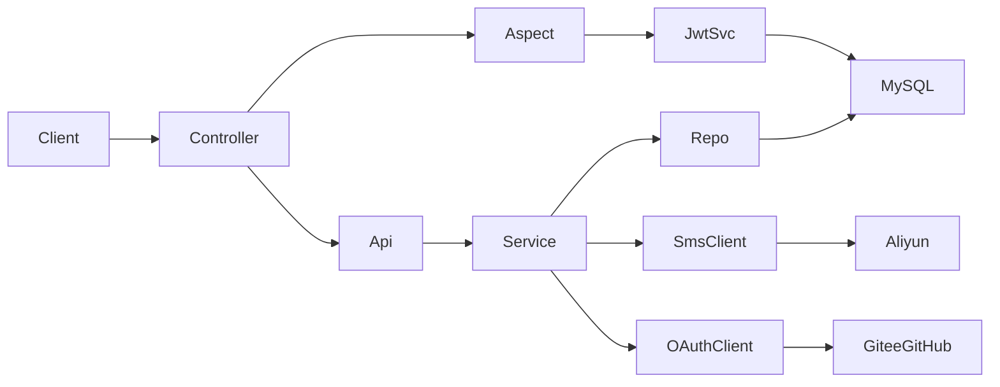

# 用户管理服务实现计划

## Triage

**Lane:** High-stakes（鉴权边界、新依赖、表结构、公开 API）

**Skills:** `layered-architecture`、`rest-api-conventions`（沿用现有 `ApiResult`）、`spring-security-jwt`（仅 JWT 签发/校验模式，不接 Spring Security FilterChain）、`spring-boot`、`multi-module-maven`、`testing-pyramid`。不引入 Flyway 自动迁移——表 SQL 先给你审。

## 已锁定决策

| 项 | 选择 |
|---|---|
| Token 形态 | **JWT**（access + refresh）；无状态验签；本阶段鉴权**不使用 Redis** |
| Token 下发 | `accessToken` 响应体，请求用 `Authorization: Bearer`；`refreshToken` 写 `HttpOnly` + `Secure` + `SameSite=Lax` Cookie |
| 会话策略 | **不强制单点登录**（允许多端同时有效）。不做 `token_version`。logout 清 Cookie；access 最长存活至 TTL（默认 2h）自然过期。禁用账号靠查库 `status` 立即拦截 |
| 限流 / OAuth state | 单机内存（Caffeine）：验证码/登录限流；OAuth `state` 用签名参数（HMAC/JWT）防 CSRF，不落 Redis |
| 鉴权 | 自定义 AOP 切面（`ANONYMOUS` / `AUTHENTICATED` / `VERIFIED`），不引入 Spring Security FilterChain |
| 渠道用户 | Gitee / GitHub / 手机各成独立 `user` 行；手机登录自动实名；OAuth 未实名，可绑定手机完成实名 |
| 配置 | `@ConfigurationProperties` + `@RefreshScope`（已有 `spring-cloud-context` + `/actuator/refresh`） |
| 用户 ID | `user.id`：起始 **10000000**；每次 `max(id) + random(step-min, step-max)`（默认如 1–99），应用层 `IdGenerateUtils` 写入；BIGINT PK，非 AUTO_INCREMENT。`user_delegate.id`：**不对外暴露**，MySQL `AUTO_INCREMENT` 从 **1** 起、固定步长 1 |
| 表 DDL | 产出到 `doc/sql/02-user-service.sql`，**等你改完再执行**；本阶段不接 Flyway |
| OAuth | Authorization Code：后端生成 authorize URL → 前端跳转 → 后端 callback 换 token、建/找用户、种 Cookie、302 回前端 |

脚手架 `compose.yaml` 里已有的 Redis **可保留不动**，但用户服务实现路径不读写 Redis。

## 架构与数据流



校验路径：解析 JWT 签名与过期 → 读 `uid` → 查库确认用户存在且 `status` 正常、取最新 `verified` 等 → 注入 `ApiRequest`。

模块落点（沿用现有分层）：

- [`flydeer-struct-mind-contract`](flydeer-struct-mind-contract)：DTO、枚举、`ApiRequest`、API 接口
- [`flydeer-struct-mind-repository`](flydeer-struct-mind-repository)：`User` / `UserDelegate` Entity + Mapper XML
- [`flydeer-struct-mind-service`](flydeer-struct-mind-service)：JwtToken / SMS / OAuth / User / Delegate 核心逻辑
- [`flydeer-struct-mind-api`](flydeer-struct-mind-api)：面向业务的编排（登录、绑定、授权用例）
- [`flydeer-struct-mind-controller`](flydeer-struct-mind-controller)：HTTP、Cookie、`@RequireUserLevel` 切面、限流、访问日志
- [`flydeer-struct-mind-common`](flydeer-struct-mind-common)：错误码常量、用户等级枚举等共享类型

## 1. 依赖与配置

父 POM [`pom.xml`](pom.xml) 统一管理并下发到对应模块：

- `com.aliyun:alibabacloud-dypnsapi20170525:2.0.0`（service）
- `org.springframework.boot:spring-boot-starter-aop`（controller）
- `jjwt-api` / `jjwt-impl` / `jjwt-jackson`（如 `0.12.6`，service）
- `com.github.ben-manes.caffeine:caffeine`（限流，service 或 controller）
- OAuth 用 `RestClient` 调 Gitee/GitHub，不引 Spring Security OAuth

[`application.yml`](flydeer-struct-mind-controller/src/main/resources/application.yml) + `.env.example` 增加可热刷新项（`@RefreshScope` 绑定类 `AuthProperties` / `OauthProperties` / `SmsProperties` / `RateLimitProperties`）：

- `auth.jwt-secret`（HS256）、`auth.access-token-ttl: 2h`、`auth.refresh-token-ttl: 90d`、`auth.refresh-cookie-name`、`auth.frontend-redirect-url`
- `id.start: 10000000`、`id.step-min`、`id.step-max`（随机步长，禁止写死）
- `oauth.gitee/github`: `client-id`、`client-secret`、`redirect-uri`、`authorize-url`、`token-url`、`user-url`
- `sms.aliyun`: `access-key-id/secret`、`sign-name`、`template-code`、`region`、`endpoint`
- 限流：验证码每手机号/IP 间隔与日上限；登录失败/刷新频率

**禁止业务代码写死 2h/90d 等魔数。**

## 2. 表结构（交付 SQL，待你调整）

`doc/sql/02-user-service.sql` 草案：

**`user`**

- `id` BIGINT PK（**非 AUTO_INCREMENT**）：首条从 **10000000** 起，之后由 `IdGenerateUtils` 按「当前最大 id + 随机步长」分配；步长上下限在配置中（如 `id.step-min` / `id.step-max`）
- `channel`：`GITEE` | `GITHUB` | `PHONE`
- `channel_uid` VARCHAR（OAuth 侧用户 id；手机渠道存规范化手机号）
- `phone` VARCHAR NULL（绑定手机；PHONE 渠道与 `channel_uid` 一致）
- `verified` TINYINT（实名：手机登录=1；OAuth 默认 0，绑手机后=1）
- `nickname` VARCHAR（仅此一项基本信息；**不存** avatar、bio 等他人可识别的个人信息）
- `status` TINYINT（如 `1=正常` / `0=禁用`；**禁用则拒绝一切需登录访问**，含 refresh；**不提供**启用/禁用对外 API，由你直接改库）
- `created_at`、`updated_at`
- UNIQUE(`channel`, `channel_uid`)；`phone` 可有条件唯一（已绑定时）

**`user_delegate`**

- `id` BIGINT PK AUTO_INCREMENT 从 **1** 起、固定步长（**仅内部主键，API 不返回、路径不用**）；`grantor_id` / `grantee_id` 引用 `user.id`

- `status`：`PENDING` | `ACCEPTED` | `REJECTED` | `CANCELLED`
- `request_type`：`GRANT` / `RECEIVE`（请求授权对方 / 请求被对方授权）
- `created_at`、`updated_at`、`responded_at`
- UNIQUE 活跃关系约束（同一对用户仅一条非终态记录）

不建全局配置表（文档推荐 `@ConfigurationProperties` + `@RefreshScope`）。

## 3. JWT 设计（无状态，无 Redis）

**Claims（access / refresh 用 `typ` 区分）**

- `sub`：用户 id
- `typ`：`access` | `refresh`
- `iat` / `exp`：签发与过期

实名状态、nickname 等**不写入 JWT**（或仅作展示用缓存），鉴权时以 DB 为准，避免绑手机后旧 token 仍显示未实名。

**登录 / 刷新 / 登出（推荐简化）**

- 登录、OAuth callback、refresh：直接签发新 access + refresh（refresh 轮换：旧 refresh 仍可能在过期前可用，个人站可接受）
- logout：清除 refresh Cookie；前端丢弃 access。服务端不维护黑名单，access 至多再有效至 TTL
- 禁用用户：每次鉴权/refresh 查 `status`，立即拒绝（与是否 logout 无关）

**校验步骤（切面）**

1. 验签 + 未过期 + `typ=access`
2. 按 `sub` 查用户：存在且 `status` 正常，否则未授权
3. 按 DB 中的 `verified` 等与 `AuthRequiredLevel` 比对

登录 / refresh / OAuth 发 token 前同样校验 `status`。

## 4. 登录与 Token

**手机号（注册即登录）**

1. `POST /api/v1/auth/sms/send` — Aliyun `SendSmsVerifyCode`（`##code##` 云端生成+核验）；Caffeine 限流
2. `POST /api/v1/auth/sms/login` — `CheckSmsVerifyCode` → 找/建 `PHONE` 用户，`verified=true`，签发双 JWT

**Gitee / GitHub**

1. `GET /api/v1/auth/{provider}/authorize` — 返回 authorize URL（`state` 为带过期的签名串）
2. `GET /api/v1/auth/{provider}/callback` — 校验 state → code 换 token → 找/建用户（`verified=false`，仅写入 `nickname`，**不落库** OAuth 头像等）→ 种 refresh Cookie → 302 前端

**会话**

- `POST /api/v1/auth/refresh` — 读 Cookie refresh JWT，验签/`typ` → 查 `status` → 签发新双 JWT（可轮换 Cookie）
- `POST /api/v1/auth/logout` — 清 Cookie（不维护服务端黑名单）
- `POST /api/v1/users/me/phone/bind` — 短信核验后写 `phone`+`verified`，并重发 token（让前端立刻带上实名态）

## 5. 切面与 BaseRequest

```java
@RequireUserLevel(UserLevel.AUTHENTICATED) // ANONYMOUS | AUTHENTICATED | VERIFIED
public ApiResult<?> foo(BaseRequest req) { ... }
```

- 切面：Bearer JWT → 验签 → 查库 `status`/实名 → 校验等级；不足则 `BusinessException`
- `ANONYMOUS`：无 token 也可进，有则注入
- 注入 `ApiRequest`：`userId`、`channel`、`verified`、`delegatedUserIds`（`List<Long>`：当前用户作为 grantee 且状态为 `ACCEPTED` 的全部授权方 userId；无授权时为空列表）
- 切面查询 `user_delegate` 批量填充该列表，业务侧按需使用，不再注入单个 `delegatedUserId`

## 6. 账户与授权 API（`/api/v1`）

**账户**

- `GET /api/v1/users/me` — 当前用户（含实名状态）
- `PATCH /api/v1/users/me` — 仅可改 `name`

**授权（UserDelegate）**

- `POST /api/v1/delegates` — 发起请求（目标用户 + `request_type`）
- `POST /api/v1/delegates/{peerUserId}/accept|reject` — 用对方 `user.id` 定位关系，**不暴露** `user_delegate.id`
- `POST /api/v1/delegates/{peerUserId}/cancel`
- `GET /api/v1/delegates` — 列表响应只含双方 userId、状态、requestType 等业务字段，**不含**内部 `id`

## 7. 限流与日志

- 验证码：手机号间隔 + IP 日限（**Caffeine 本地缓存**，单机 2C2G 足够）
- 登录 / refresh 适度限流
- Controller/Filter 记录 `userId|anonymous`、path、耗时；访问量打日志

## 8. 分层实现清单（核心类）

| 层 | 类 |
|---|---|
| contract | `AuthRequiredLevel`、`LoginChannelEnum`、`ApiRequest`、Auth/User/Delegate DTO、`AuthorizationApi`/`UserMangeApi`/`DelegateApi` |
| repository | `UserEntity`、`UserDelegateEntity`、`UserMapper`、`UserDelegateMapper` + XML |
| service | `JwtTokenUtils`、`IdGenerateUtils`（随机步长）、`SmsVerifyService`、`OauthService`、`UserMangeApi`、`UserDelegateApi`、Properties、`RateLimitUtils` |
| api | `AuthorizationApiImpl`、`UserMangeApiImpl`、`UserDelegateApiImpl` |
| controller | `AuthController`、`UserController`、`DelegateController`、`RequireUserLevelAspect`、限流拦截、Cookie 工具 |

沿用现有 `ApiResult` / `BusinessException` / `GlobalExceptionHandler`；扩展未登录/无权限/token 失效错误码。

## 9. 测试与交付顺序

1. 写 `doc/sql/02-user-service.sql` → **停：你调整并确认**
2. 依赖 + Properties + `JwtTokenUtils`（无状态）+ 单测
3. User/Delegate 持久化 + Service
4. SMS（接口抽象 + Fake）与 OAuth（Mock）
5. 切面 + Controller + Cookie
6. 本地限流与访问日志
7. 集成测试：Testcontainers **MySQL** 覆盖登录/refresh、禁用拦截、等级切面、授权流转

## 不在本阶段

- Spring Security FilterChain（仅用 jjwt 自管签发校验）
- 用 Redis 存 token / session / 限流
- 强制单点登录 / `token_version` 踢旧
- Flyway 自动执行（等你批 SQL 后再说）
- 合并多渠道为同一账号（仅 Delegate 授权，不 merge）
- 用户启用/禁用的管理接口（`status` 仅服务端校验，改库由你 SQL 操作）
