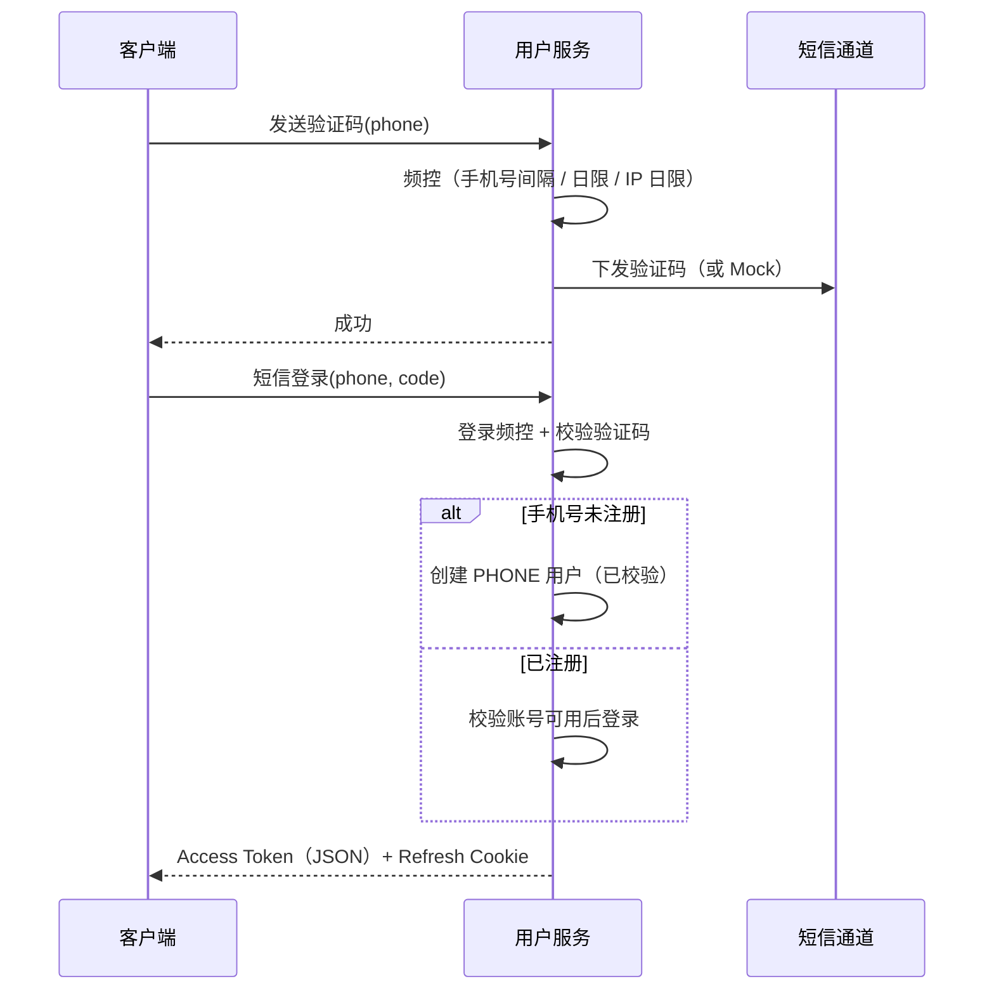
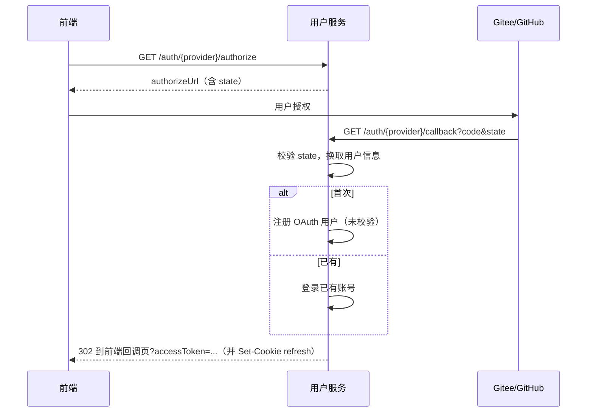

# 11-用户服务-业务流程

> 从业务视角描述用户服务对外能力与流程，不展开内部实现细节。接口字段见 [12-用户服务-api.md](./12-用户服务-api.md)。

---

## 1. 能力总览

用户服务当前覆盖三类对外能力：

| 能力域 | 说明 |
|---|---|
| **认证（Auth）** | 登录、刷新会话、登出；支持手机号短信与 Gitee / GitHub OAuth |
| **用户资料（User）** | 查看 / 修改昵称；OAuth 账号绑定手机号完成「实名校验」态 |
| **委托代理（Delegate）** | 发起代理关系、对方同意、任一方撤销、按身份查询关系列表 |

没有密码登录；没有微信登录。会话模型为 **双 Token**：

- **Access Token**：放在请求头 `Authorization: Bearer ...`，短有效期（默认 2h）。
- **Refresh Token**：写入 HttpOnly Cookie（默认名 `refresh_token`，Path `/api/v1/auth`），长有效期（默认 90d）。登录 / 刷新接口的 JSON 体中不会返回 refresh（已剥离进 Cookie）。

---

## 2. 账号与登录渠道

每个用户对应一条「渠道身份」记录，由 `(channel, channel_uid)` 唯一确定：

| 渠道 | `channel` | `channel_uid` 含义 | 注册后是否默认已校验（verified） |
|---|---|---|---|
| 手机号短信 | `PHONE` | 规范化手机号 | 是（手机号即实名凭证） |
| Gitee | `GITEE` | 平台用户 ID | 否，需后续绑手机 |
| GitHub | `GITHUB` | 平台用户 ID | 否，需后续绑手机 |

业务含义上的 **verified（已校验）**：

- 手机号渠道注册即视为已校验。
- OAuth 渠道需完成「绑定手机号」后变为已校验，并重新签发带 `verified=true` 的 Token。
- 后续若有接口要求「已校验用户」，未绑手机的 OAuth 用户会被拒绝（当前用户资料类接口只要求已登录）。

账号状态：

- **ACTIVE**：可登录、可刷新、可操作。
- **DISABLED**：不可用（业务上视为无效用户）。

用户对外可见 ID 为应用分配的数值 ID（从千万级起跳），不是委托表内部自增主键。

---

## 3. 登录方式与流程

### 3.1 手机号短信登录（注册一体）

适用：新用户注册 + 老用户登录，同一套接口。



要点：

1. 手机号格式：大陆 `1` 开头 11 位。
2. 客户端只需提交手机号与验证码；IP 由服务端从请求解析，用于限流。
3. 本地默认 `SMS_MOCK_ENABLED=true`：可不接真实短信；联调时注意与生产行为差异。
4. 登录成功后客户端应持久化 Access Token，并依赖浏览器 / HTTP 客户端自动携带 Refresh Cookie（跨域场景需配置凭证与 Cookie 域）。

### 3.2 Gitee / GitHub OAuth 登录

适用：第三方账号一键登录；未绑手机时为「未校验」用户。



要点：

1. `provider` 仅支持路径枚举：`gitee`、`github`（大小写与枚举名一致，当前为小写路径）。
2. Callback **不返回 JSON**，而是 302 到配置的前端地址（`AUTH_FRONTEND_REDIRECT`），Query 携带 `accessToken`。
3. 前端回调页应立刻取走 Access Token 存入本地，并清理 URL，避免 Token 残留在浏览器历史中。
4. Refresh Cookie 在 Callback 响应中写入；前端后续调 `/auth/refresh` 时需带上 Cookie。

### 3.3 刷新会话

1. 客户端调用刷新接口（无需 Body；Refresh 从 Cookie 读取）。
2. 服务端校验 Refresh Token、确认用户仍为可用状态。
3. 重新签发 Access + Refresh，再次写入 Cookie，JSON 仅返回新的 Access（及过期秒数）。

Refresh 缺失或无效 → 需要重新登录。

### 3.4 登出

清除 Refresh Cookie。当前 **没有** 服务端 Token 黑名单：已签发的 Access Token 在过期前仍可能被接受，前端应同时丢弃本地 Access Token。

---

## 4. 用户资料流程

均需已登录（Bearer Access Token）。

| 场景 | 流程摘要 |
|---|---|
| 查看自己 | 拉取当前用户资料；手机号脱敏（如 `138****5678`） |
| 修改昵称 | 提交新名称（最长 20 字），返回更新后的资料 |
| OAuth 绑手机 | 已登录用户发短信 → 提交验证码绑定 → 账号变为已校验，并换发新 Token（含新 Refresh Cookie） |

绑手机约束（业务规则）：

- **手机号渠道账号不能再绑手机**（本身已是手机身份）。
- 同一登录渠道下，一个手机号不能被多个不同账号重复绑定（冲突则失败）。
- 绑定成功后 Token 中的 verified 变为 true，前端应替换本地 Access Token。

---

## 5. 委托代理流程

委托代理表达的是：**代理人（manager）申请管理「被代理人」账号；被代理人同意后生效。**

表意约定（与接口字段对应）：

| 角色 | 含义 | 关系枚举 |
|---|---|---|
| 代理人 | 发起代理、持有管理权限的一方 | 查询时用 `MANAGING`（我代理的） |
| 被代理人 | 被申请管理、需同意的一方 | 查询时用 `MANAGED`（代理我的） |

状态机：

```
        发起 / 再次发起
    ┌──────────────────┐
    │                  ▼
 (无) ──create──► PENDING ──accept──► ACCEPTED
                    │                   │
                    └──── revoke ───────┘
                              │
                              ▼
                           REVOKE
```

- `PENDING`：已发起，待被代理人同意。
- `ACCEPTED`：生效中；认证解析在「委托范围」模式下可把被代理人 ID 并入可操作集合（为后续业务预留）。
- `REVOKE`：已撤销；可再次 `create` 将关系拉回 `PENDING`。

### 5.1 典型协作路径

1. **用户 A 想代理用户 B**  
   A 调用创建，`operateId = B`。关系进入 `PENDING`（若已是 PENDING/ACCEPTED 则幂等保持）。
2. **用户 B 同意**  
   B 调用接受，`operateId = A`。关系变为 `ACCEPTED`。
3. **任一方撤销**  
   - A（代理人）撤销：`relation=MANAGING`，`operateId=B`  
   - B（被代理人）撤销：`relation=MANAGED`，`operateId=A`
4. **查询**  
   按 `relation` 区分「我代理的」或「代理我的」，可按状态列表过滤。

约束：

- 不能代理自己。
- 对方用户必须存在且为可用状态（创建 / 接受时会校验）。
- 撤销必须带上身份 `relation`，否则请求不合法。

---

## 6. 前端集成建议（流程向）

1. **未登录态**：短信登录或拉 OAuth URL；OAuth 走完整跳转，短信走双接口。
2. **已登录态**：所有 `/api/v1/user/**` 请求带 `Authorization: Bearer <accessToken>`。
3. **会话续期**：Access 临近过期时调 `/api/v1/auth/refresh`（需 Cookie）；失败则回登录页。
4. **OAuth 新用户**：引导绑定手机，再进入需要「已校验」的能力。
5. **代理功能**：创建方与接受方使用的 `operateId` 语义相反（分别是对方的 userId），联调时务必按角色区分。
