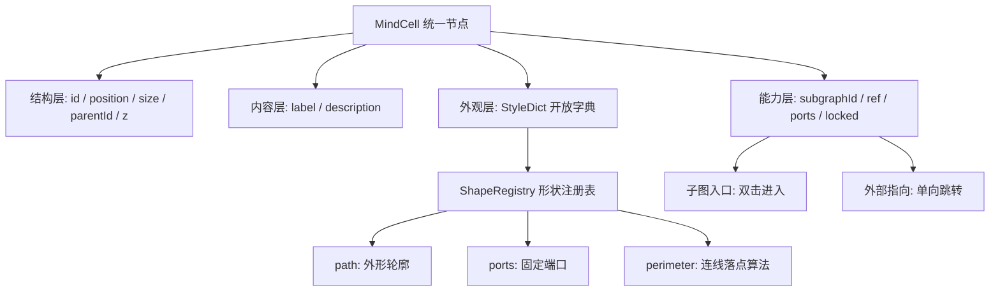

# 节点体系：开发方案

> 承接 `doc-plan/04-drawio-nodes.md`（draw.io 调研）。调研解决「别人怎么做」，本文解决「我们怎么做」。
> 涵盖节点模型定义、形状与连接点实现、复杂节点、外部指向、后端存储与交互设计。本阶段仅输出设计，实现分期进行。

---

## 1. 设计取向：从强类型枚举转向弱类型 cell

### 1.1 现状与问题

当前节点是强类型枚举（`src/types/index.ts`）：

```ts
export type BasicNode = Node<BasicNodeData, 'basic'>;
export type GraphRefNode = Node<GraphNodeData, 'graph'>;
export type MindNode = BasicNode | GraphRefNode;
```

每一种节点对应一个独立 React 组件，在 `src/flow/nodeTypes.ts` 注册。这个模式在两种类型时很清爽，但每加一种外观就要加一个 `type`、一个组件、一条注册项、一处 `addNode` 分支、一处详情面板分支、一处导入导出分支。外观与语义被绑死：想让某个节点画成菱形，就得造一个 `diamond` 类型，而它的业务含义和 `basic` 毫无区别。

### 1.2 取向

采纳 draw.io 的核心哲学：**一个统一的 cell 模型 + 开放的 style 字典 + 可插拔的形状注册表**。外观不再是类型，而是 `style.shape` 的取值；新增形状只需往注册表加一条，不碰数据模型、不碰存储、不碰 React Flow 注册项。

但本项目有两个 draw.io 没有的强语义绕不开：**子图入口**（图作为图内的一个节点）和**外部指向**（指向图集内其他节点）。这两者不做成节点类型，而是做成**能力标记（capability flag）**——对应 draw.io 用 `container=1` 表达「可容纳子元素」、用 `UserObject.link` 表达「可跳转」的思路。节点只有一种，带不带这两个字段决定它多出什么行为。

好处是二者可以正交组合：一个子图入口节点同时可以有外部指向；一个菱形判断节点也可以是子图入口。强类型枚举下这些组合会导致类型爆炸。

### 1.3 模型分层



四层对应 draw.io 的：结构层 ≈ `mxCell` + `mxGeometry`，外观层 ≈ style 串，能力层 ≈ `container` / `UserObject`，形状注册表 ≈ `registerShape` + Stencil。

---

## 2. 统一节点模型

### 2.1 类型定义

```ts
/** 统一节点数据。所有节点共用，差异由 style 与能力字段表达 */
export interface MindCellData extends Record<string, unknown> {
  /** 主标签 */
  label: string;
  /** 描述，详情面板编辑；部分形状（note）可直接渲染 */
  description?: string;

  /** 外观：开放字典，未知 key 忽略渲染但必须原样保留 */
  style: StyleDict;

  /** 能力：子图入口。有值即为「图节点」，双击进入该图 */
  subgraphId?: string;
  /** 能力：外部指向。最多一个，单向，不产生反向关系 */
  ref?: NodeRef;
  /** 能力：端口覆写。缺省时由 shape.ports 提供 */
  ports?: PortConstraint[];
  /** 能力：锁定，禁止移动/缩放/删除 */
  locked?: boolean;
}

/** 开放样式字典。值域限定为标量，便于 JSON 存储与 diff */
export type StyleDict = Record<string, string | number | boolean>;

/** 外部指向：指向图集内某个节点 */
export interface NodeRef {
  /** 目标图 id。冗余字段，用于免全图集扫描直接定位 */
  graphId: string;
  /** 目标节点 id，权威标识 */
  nodeId: string;
  /** 目标标签快照。目标失效时降级显示，不参与一致性校验 */
  labelSnapshot?: string;
}

/** 统一 cell 节点。React Flow type 固定为 'cell' */
export type MindCell = Node<MindCellData, 'cell'>;
export type MindNode = MindCell;
```

节点几何沿用 React Flow 顶层字段（`position` / `width` / `height` / `parentId` / `zIndex`），不搬进 `data`——React Flow 的交互（拖拽、缩放、`extent: 'parent'`）依赖这些顶层字段。

### 2.2 style 字典：为什么用 JSON object 而不是分号串

draw.io 用 `rounded=1;fillColor=#DAE8FC;strokeColor=#6C8EBF;` 这种分号串，是历史包袱（XML 属性只能放字符串）。我们的存储层本来就是 JSON，用 object 更合适：

| 维度 | 分号串 | JSON object（采用） |
|---|---|---|
| 解析 | 需自写 parse/serialize | 原生 |
| 类型 | 全是 string，数字要转 | 保留 number / boolean |
| diff | 整串替换 | 逐 key，利于后续协同编辑 |
| 校验 | 无 | 可按 key 白名单校验 |

保留 draw.io 的**开放哈希表哲学**：

1. **未知 key 忽略渲染**——老版本前端遇到新形状参数不报错，画出降级外观。
2. **未知 key 必须原样保留**——这条是硬约束。老前端读了图再存回去，不得删掉它不认识的 key，否则新前端的数据会被静默抹掉。实现上意味着渲染时读白名单、序列化时写全量。

### 2.3 style key 白名单

渲染层维护 `styleSchema`：key → 类型 → 目标（SVG 属性 / CSS 变量 / 布局参数）。不在表内的 key 存但不渲染。**禁止把 style 值直接拼进 `style` 属性或 `dangerouslySetInnerHTML`**，只允许经白名单映射到具体属性，避免样式注入。

| 分类 | key | 类型 | 说明 |
|---|---|---|---|
| 形状 | `shape` | string | 形状注册表键名，缺省 `roundRect` |
| | `aspect` | `'variable' \| 'fixed'` | 覆写形状默认宽高比策略 |
| | `arcSize` | number | 圆角半径（px） |
| | `direction` | `'east' \| 'south' \| 'west' \| 'north'` | 形状朝向（三角、文档形等） |
| | `rotation` | number | 旋转角度（度） |
| 填充描边 | `fillColor` | string | `none` / 语义 token 名 / `#RRGGBB` |
| | `strokeColor` | string | 同上 |
| | `strokeWidth` | number | |
| | `dashed` | boolean | |
| | `dashPattern` | string | 如 `"8 4"` |
| | `opacity` | number | 0–100 |
| | `shadow` | boolean | |
| 文本 | `fontSize` / `fontFamily` / `fontColor` | number / string | |
| | `bold` / `italic` / `underline` | boolean | 拆成三个布尔，不用 draw.io 的位掩码 |
| | `align` / `verticalAlign` | string | 框内对齐 |
| | `labelPosition` | string | 标签贴外侧（`top` / `bottom` / `left` / `right` / `center`） |
| | `whiteSpace` | `'wrap' \| 'nowrap'` | |
| | `overflow` | `'visible' \| 'hidden' \| 'ellipsis'` | |
| 布局 | `spacing` | number | 内边距 |
| | `container` | boolean | 可容纳子节点 |
| | `startSize` | number | 泳道头高度 |
| 行为 | `connectable` / `resizable` / `movable` | boolean | 缺省 true，受全局模式二次约束 |
| | `floating` | boolean | 是否启用浮动连接（见第 4 节） |

**颜色取值优先语义 token**（`accent` / `line-strong` / `surface-2`，见 `doc-plan/02-ui-design.md`），而非硬编码十六进制。这样后续换主题时用户创建的节点跟着变，不会在深色主题上留一片刺眼的浅色卡片。仅当用户在格式面板显式取色时才写入十六进制。

### 2.4 尺寸从「内容自适应」改为「显式几何」

这是模型改造的一个隐性但影响很大的后果，需要提前明确。

现在的节点用 Tailwind 的 `min-w-32 max-w-56` 由内容撑开，没有明确宽高。形状化之后，SVG 轮廓必须知道 `w`/`h` 才能画路径，端口坐标也要按 `w`/`h` 换算，所以**节点必须携带显式 `width` / `height`**。

处理方式：

- 创建节点时由 `shape.defaultSize` 写入显式宽高。
- 用 `<NodeResizer>` 提供手动调整；`aspect: 'fixed'` 的形状（圆、正菱形）锁定比例。
- 保留一个 `autosize` 能力：文本超出时按标签测量结果撑高（仅高度，不改宽度），对应 draw.io 的 `autosize`。默认关闭。
- 导入外部 JSON 时若缺 `width` / `height`，按 `shape.defaultSize` 补齐。

---

## 3. 形状注册表

### 3.1 接口

```ts
export interface ShapeDef {
  /** 注册键，即 style.shape 的取值 */
  name: string;
  /** 面板分组与展示名 */
  group: ShapeGroup;
  title: string;
  /** variable 随拉伸；fixed 锁定宽高比 */
  aspect: 'variable' | 'fixed';
  defaultSize: { w: number; h: number };
  /** 默认 style，实例化时与用户 style 合并 */
  defaultStyle?: StyleDict;

  /** 外形轮廓：返回 SVG path d，坐标系原点为节点左上角 */
  path: (w: number, h: number, style: StyleDict) => string;
  /** 前景装饰：内部线条、图标等，可选 */
  decor?: (w: number, h: number, style: StyleDict) => ReactNode;

  /** 固定端口，相对坐标 0–1 */
  ports: PortConstraint[];
  /** 连线落点算法，与外形配对 */
  perimeter: PerimeterFn;
  /** 标签安全区，避开非矩形的斜边 */
  labelArea?: (w: number, h: number) => Rect;
}

export type ShapeGroup = '通用' | '流程' | '容器' | '标注' | '数据';
```

`path` 与 `decor` 分离，对应 draw.io stencil 的 `background` / `foreground`：`path` 是参与填充、描边、阴影和命中测试的主轮廓，`decor` 是纯装饰，不影响连线与点击。

### 3.2 三档实现

对应调研文档 2.2 节的三种来源：

**① 内置几何**（第一期）——纯 path 函数，无额外参数：

`rect` / `roundRect` / `ellipse` / `circle` / `diamond` / `hexagon` / `parallelogram` / `triangle`

```ts
const diamond: ShapeDef = {
  name: 'diamond',
  group: '流程',
  title: '判断',
  aspect: 'variable',
  defaultSize: { w: 140, h: 90 },
  path: (w, h) => `M ${w / 2} 0 L ${w} ${h / 2} L ${w / 2} ${h} L 0 ${h / 2} Z`,
  ports: FOUR_WAY,
  perimeter: rhombusPerimeter,
  labelArea: (w, h) => ({ x: w * 0.25, y: h * 0.25, w: w * 0.5, h: h * 0.5 }),
};
```

**② 扩展几何**（第二期）——带专用参数的参数化 path：

`note`（折角便签）/ `document`（波浪底）/ `process`（双竖线）/ `step` / `callout`（气泡尾巴）/ `cylinder`（数据存储）/ `subprocess`（双边框，子图入口默认外形）

**③ Stencil**（第三期）——声明式模板，用于外部图标库：

不照抄 draw.io 的 XML DSL，改用等价的 JSON 结构（`{ w, h, aspect, connections[], background[], foreground[] }`，图元为 `rect` / `ellipse` / `path` / `text`），由通用解释器渲染成 ShapeDef。第一期只定义接口占位、不实现，避免过早引入解释器复杂度。

### 3.3 特殊形状：`text` 与 `group`

两个交互形态与普通节点差异过大的形状，单独在 React Flow 注册组件：

| 类型 | 说明 |
|---|---|
| `cell` | 通用节点，承载全部注册表形状 |
| `text` | 纯文本标注，无填充无描边，点击区域仅文字，默认 `connectable: false` |
| `group` | 透明分组容器，`pointerEvents` 只在边框生效，避免遮挡内部子节点的点击 |

`nodeTypes` 从现在的 `{ basic, graph }` 变为 `{ cell, text, group }`，且**不再随形状增长**。

---

## 4. 连接点与 perimeter

这是整套方案技术难度最高、也最容易做砸的一环，单列一节。

### 4.1 问题

draw.io 的教训（调研 5.2 节）：**非矩形外形必须配对正确的 perimeter，否则连线吸附到包围盒而不是可见轮廓**。菱形节点的连线会停在外接矩形的边上，视觉上悬空一截。

React Flow 的 `<Handle>` 是绝对定位的 DOM 元素，边的端点就是 Handle 的中心。它天然只能做「固定端口」，做不到「按目标方向动态贴合轮廓」。两条路径，按形状复杂度分别采用。

### 4.2 路径一：固定端口（第一期，覆盖大多数场景）

```ts
export interface PortConstraint {
  /** 端口 id，同一节点内唯一。方位端口用 'n' / 'e' / 's' / 'w' */
  id: string;
  /** 相对 bounds 的比例坐标 */
  x: number;
  y: number;
  /** 像素级微调 */
  dx?: number;
  dy?: number;
  /** Handle 朝向，决定连线的出线方向与贝塞尔控制点 */
  side: Position;
  /** 是否既可作起点又可作终点，缺省 true */
  bidirectional?: boolean;
}

const FOUR_WAY: PortConstraint[] = [
  { id: 'n', x: 0.5, y: 0,   side: Position.Top },
  { id: 'e', x: 1,   y: 0.5, side: Position.Right },
  { id: 's', x: 0.5, y: 1,   side: Position.Bottom },
  { id: 'w', x: 0,   y: 0.5, side: Position.Left },
];
```

渲染：按 `x * width + (dx ?? 0)` 绝对定位。双向端口在同一坐标叠放 source 与 target 两个 Handle（React Flow 不支持单 Handle 双角色），target 置于下层且尺寸略大，便于连线时命中。

```tsx
{ports.map((p) => (
  <Fragment key={p.id}>
    <Handle
      id={p.id} type="target" position={p.side}
      style={{ left: p.x * width + (p.dx ?? 0), top: p.y * height + (p.dy ?? 0) }}
    />
    <Handle
      id={p.id} type="source" position={p.side}
      style={{ left: p.x * width + (p.dx ?? 0), top: p.y * height + (p.dy ?? 0) }}
    />
  </Fragment>
))}
```

注意端口 id 会写进边的 `sourceHandle` / `targetHandle`，属于**持久化数据**。因此端口 id 一经发布不可重命名，形状换端口布局时要保证旧 id 仍可解析（找不到时降级到最近的方位端口）。这也是端口 id 用 `n/e/s/w` 这类稳定语义名、而不是数组下标的原因。

**端口显隐**：默认隐藏，节点 hover 或连线拖拽进行中时显示（draw.io 的绿色固定连接点交互）。浏览模式下永不显示。

### 4.3 路径二：浮动连接（第二期，解决轮廓贴合）

对 `style.floating = true` 的节点启用：

1. 节点渲染一个覆盖全域的 Handle（`type="source"`，透明、`pointer-events` 仅在 hover 时开启），使得从形状任意位置都能拖出连线。
2. 配套自定义 edge。edge 内用 `useInternalNode(id)` 拿到两端的 `internals.positionAbsolute` 与 `measured` 尺寸，各自调用对端 shape 的 `perimeter` 求交点，再交给 `getBezierPath` / `getSmoothStepPath`。

```ts
export type PerimeterFn = (
  bounds: Rect,          // 节点绝对包围盒
  towards: XYPosition,   // 对端参考点（通常是对端中心）
  style: StyleDict,
) => XYPosition;         // 轮廓上的落点
```

内置三种即可覆盖绝大部分形状，其余形状复用最接近的一种：

- `rectanglePerimeter`——射线与矩形边求交
- `ellipsePerimeter`——射线与椭圆参数方程求交
- `rhombusPerimeter`——射线与四条斜边求交

**取舍**：浮动连接让菱形、椭圆的连线不穿帮，代价是边必须自定义组件、每帧参与计算，且边端点不再是稳定的端口 id（`sourceHandle` 为空）。因此**两种模式共存**：形状可声明默认模式，用户也可在格式面板切换。规则约定为——只要边的 `sourceHandle` / `targetHandle` 有值就走固定端口，否则走浮动计算。这条规则让两种模式在同一张图里混用不冲突。

### 4.4 旋转与端口

`style.rotation` 非零时，端口坐标必须绕节点中心做同样的旋转，否则连线接到旋转前的位置。实现上端口容器与形状 SVG 共用一个 `transform: rotate()` 的包裹层，让 DOM 自然带着 Handle 一起转；perimeter 计算则需要把 `towards` 逆旋转到形状本地坐标系求交、再正旋转回去。

---

## 5. 复杂节点实现

### 5.1 容器与分组

用 React Flow 原生的 `parentId` + `extent: 'parent'`，对应 draw.io 的 `container=1`：

- `style.container = true` 的节点接受子节点拖入；拖拽命中判定用「落点在容器 bounds 内且容器 z 序最靠上」。
- 子节点 `position` 变为相对父节点，这点与 draw.io 的 `mxGeometry` 一致。
- 序列化时子节点仍平铺在 `nodes[]` 里，靠 `parentId` 表达从属；**要求父节点在数组中先于子节点出现**，这是 React Flow 的硬性约束，保存前需做一次拓扑排序。
- 删除容器时询问：连同子节点删除，还是仅解除从属。

**容器与子图入口是两个正交概念，不要混用**（调研 6.1 节第 4 点）：容器是同画布的父子关系，子图入口是跨画布的引用。一个节点可以同时是容器和子图入口，但含义不同——前者管它框住的东西，后者管它指向的那张图。

### 5.2 泳道

容器的特化：`style.startSize` 定义头部高度，头部渲染标题栏并作为整体拖拽把手，主体区域接受子节点。`childLayout` 暂不做自动排布，第一期手动摆放。

### 5.3 子图入口节点

`subgraphId` 有值即为子图入口，默认外形 `subprocess`（双边框）。

- 卡片上显示目标图名与节点数（`graphs[subgraphId].nodes.length`），沿用现有 `GraphNode` 从 store 读取目标图的做法。
- 双击进入，逻辑保留现有 `CanvasArea` 的 `onNodeDoubleClick`。
- 目标图不存在时显示「未链接目标图」并加失效样式，不阻塞渲染。
- 与 `Graph.parentGraphId` 的关系维持现状：「新建子图」时写入 `parentGraphId`，「链接已有图」不改动目标图的 `parentGraphId`（一张图只能有一个目录位置，但可以被多处链接）。

### 5.4 富标签

支持受限 HTML 子集（draw.io 同样只支持子集）：`b` / `i` / `u` / `br` / `div` / `span` / `ul` / `ol` / `li` / `code`。

存储在 `data.label`，用 `style.html = true` 标记按 HTML 渲染。**渲染前必须经白名单 sanitize**（剥离所有属性、事件、`style`、`script`、`iframe`），因为图集内容可发布、会被其他用户浏览，这是 XSS 面。第一期只做纯文本，`html` 能力留到第二期随富文本编辑器一起上。

### 5.5 节点能力矩阵

各能力与形状正交，任意组合合法：

| 能力 | 字段 | 视觉 | 交互 |
|---|---|---|---|
| 子图入口 | `subgraphId` | 双边框 + 图标 + 目标图名 | 双击进入 |
| 外部指向 | `ref` | 右上角标 | 点击角标跳转 |
| 容器 | `style.container` | 虚线内边距区域 | 接受子节点拖入 |
| 锁定 | `locked` | 角标锁形 | 禁止移动/缩放/删除 |
| 指向失效 | 不预先检测 | 与正常角标无异 | 点击跳转时报错并提示重新指向 |

---

## 6. 外部指向

### 6.1 语义

为任意节点添加**一个**指向，目标是同图集内的任意节点（可以在别的图，也可以在同一张图）。**单向，不需要反向跳转**。

两条刻意简化的约束：

1. **单向、无反向边**——数据里只有出边，删除目标不需要回写源节点，导入导出不需要维护双向一致性。
2. **不做有效性校验**——写入时不检查目标是否存在，加载时也不做批量体检。指向就是一对 id，失败只在**用户点击跳转的那一刻**暴露为一条错误提示。

第 2 条是本节最重要的取舍，见 6.4。

### 6.2 数据

```ts
interface NodeRef {
  graphId: string;
  nodeId: string;
  labelSnapshot?: string;
}
```

三个字段各有分工：

- `nodeId` 是**权威标识**。节点 id 由 `genId('nod')` 生成（uuid 前 12 位十六进制，48 位熵），在图集范围内可视作唯一。
- `graphId` 是**定位字段**。有了它跳转时只需加载目标图这一张，不必把整个图集拉进内存。
- `labelSnapshot` 是**降级显示**。目标图未加载或已失效时，角标仍能显示一个有意义的名字，而不是一串 id。它是快照、允许过期，**不参与任何判断**。

### 6.3 跳转：按目录打开目标图

跳转不是「把画布换成另一张图」那么简单。工作区的**标签栏只承载根图**，内嵌图不产生独立标签（`04-workplace-up.md` 2.3）。所以指向一个深层内嵌图里的节点时，必须先把目标图在目录树中的位置解出来，再逐层落位：打开它所属的**根图标签** → 把目录树切到那棵树并高亮到目标图 → 画布切到目标图 → 最后才定位节点。

#### 完整流程

```
jumpToRef(ref):

1. 解析目标图
   graphs[ref.graphId] 不存在        ──> toast「目标图不存在」，中止
   目标图 atlasId ≠ 当前图集          ──> toast「目标不在当前图集」，中止

2. 确保内容已加载
   只有元信息（懒加载下的常态）      ──> await 拉取图内容
   拉取失败                          ──> toast「目标图不存在」，中止

3. 按目录落位  ← 本节重点
   path   = getGraphPath(graphs, ref.graphId)   // 根图在前的完整路径
   rootId = path[0].id
   rootId ∉ openGraphIds             ──> 追加为新标签
   activeGraphId = ref.graphId                  // 激活图是内嵌图本身，不是根图
   目录树面板切到 rootId 的树、高亮 ref.graphId；收起态则面包屑渲染 path

4. 定位节点
   nodes 里找不到 ref.nodeId         ──> toast「目标节点不存在」，停在目标图不再定位
   fitView 到该节点（保持当前 zoom，仅平移）
   selectedNodeId = ref.nodeId，高亮闪烁 1.2s

5. navHistory 压入来源 { graphId, nodeId }
```

第 3 步**直接复用现有的 `openGraph(graphId)`**，它已经实现了这套语义：

```555:565:src/stores/workspaceStore.ts
/** 由 parentGraphId 链推导当前图的路径（根图在前），用于面包屑 */
export function getGraphPath(graphs: Record<string, Graph>, graphId: string): Graph[] {
```

```251:261:src/stores/workspaceStore.ts
    openGraph: (graphId) => {
      const { graphs, openGraphIds } = get();
      if (!graphs[graphId]) return;
      // 标签栏只承载根图：打开内嵌图时把其所属根图加入标签，激活图指向内嵌图本身
      const rootId = getGraphPath(graphs, graphId)[0]?.id ?? graphId;
```

复用而不是另写一条跳转路径，好处是**跳转与「用户在目录树上点一个节点」走的是同一个入口**，标签栏、目录树、面包屑三处的状态天然一致，不需要为跳转单独维护一套同步逻辑。

#### 四种落位情形

| 目标位置 | 标签栏 | 目录树 | 画布 |
|---|---|---|---|
| 就是当前图 | 不变 | 不变 | 不切换，直接定位 + 高亮 |
| 当前根图子树内的另一张图 | 不变 | 高亮移到目标图 | 切换 |
| 另一个**已打开**根图的子树内 | 激活该标签 | 整棵树换成该根图的 | 切换 |
| 另一个**未打开**根图的子树内 | 追加新标签并激活 | 同上 | 切换 |

#### 一个硬前提：元信息必须全量在内存

`getGraphPath` 沿 `parentGraphId` 链向上走，**中间任何一环缺失，路径就断在那里**，`path[0]` 会退化成一个中途的内嵌图，被误当成根图塞进标签栏。

所以 store 的 `graphs` 必须持有图集内**全部图的元信息**（`id` / `name` / `parentGraphId` / `nodeCount`），哪怕它们的 `nodes` / `edges` 还没加载。落到接口上就是：进入工作区时先 `graphs/list` 拉全量元信息建树，打开哪张图再 `graphs/detail` 拉哪张的内容（见 `07-graph-api.md` 7.1）。跳转到一张从未打开过的深层图之所以能正确落位，全靠这份元信息。

实现上 `graphs: Record<string, Graph>` 里会同时存在「元信息占位」与「已加载完整内容」两种条目，需要一个 `loaded: boolean` 或 `nodes === undefined` 之类的标记来区分，避免把未加载的图当成空图渲染。

#### 返回

「返回」用**浏览历史栈**实现，而不是在数据里造反向关系：store 维护 `navHistory: { graphId, nodeId }[]`，跳转时压入来源位置，工作区提供「← 返回」按钮出栈并按同一套流程落位回去。这与浏览器前进后退是一个模型——用户需要的是「回到我刚才在的地方」，不是「这个节点的反向链接」，二者不该混为一谈。

创建交互见第 8.4 节。

### 6.4 不做校验：失败只在跳转时暴露

指向的目标可能失效（目标节点被删、目标图被删、用户手填了错 id）。本方案**放弃一切主动校验**：

| 不做的事 | 原本要付出的代价 |
|---|---|
| 写入时校验目标存在 | 保存 A 图要跨图读 B 图，破坏「图为单位」的写模型 |
| 加载图集时批量体检 | 必须一次性加载图集全部图，与按需加载互斥 |
| 维护反向索引 | 前端内存倒排表或后端派生表 + 保存时重算 |
| 删除节点时提示「有 N 处指向此节点」 | 依赖上面的反向索引 |
| 目标跨图移动后自动修正 `graphId` | 依赖全图集扫描 |

换来的是：**`ref` 只是节点 data 里的两个字符串，对存储层完全透明。**图服务不需要知道 ref 存在，不需要索引表，不需要跨图查询接口，也不需要任何跨图一致性逻辑（详见 7.3）。

代价是失效指向不会被提前发现，用户点了才知道。这在本产品里是可接受的——指向是作者自己在自己的图集里建立的，规模有限，且失败的后果只是一次无效点击。补偿措施只做最轻的两条：

1. **失败提示明确**：toast 区分「目标图不存在」与「目标节点不存在」，并在详情面板高亮 ref 区域，提供「清除指向」「重新指向」。
2. **优先走选择器**：创建指向时默认用节点选择器（8.4 节）挑目标，而不是手填 id。选择器只从**已加载的图**里选，选中那一刻目标必然存在。手填 id 作为兜底入口保留，填错就是跳转时报错。

### 6.5 导入导出与复制粘贴

| 场景 | ref 处理 |
|---|---|
| 图集导出/导入 | 随全部 graphId / nodeId 一并重映射（扩展现有 `remapAtlasImport`） |
| 单图导出/导入 | 目标不在文件内，**清空 ref**（对齐现有 `remapGraphImport` 清空 `graphId` 的做法） |
| 同图集内复制粘贴 | ref 保留（目标仍然有效） |
| 跨图集复制粘贴 | 清空 ref，粘贴后 toast 提示「已清除 N 个跨图集指向」 |

同一条规则也适用于 `subgraphId`。

---

## 7. 后端存储

### 7.1 主存维持现状：图为单位的 JSON 文档

节点**不单独建表**，作为 `Graph.nodes[]` 随 `PUT /graphs/{graphId}` 全量保存。这个决定不变，理由：

- 一次编辑会话通常修改一张图里的多个节点，图粒度的全量写比节点粒度的增量写简单得多，也不需要事务。
- 节点 schema 是开放的（style 字典），关系表存不下，存成 JSON 列等于没建表。
- 现有前端（`mutateActiveGraph` → 防抖本地草稿 → 显式 `PUT`）已经是这个模型，不需要改造。

节点在图文档里的形态：

```json
{
  "id": "nod_a1b2c3d4e5f6",
  "type": "cell",
  "position": { "x": 240, "y": 120 },
  "width": 160,
  "height": 80,
  "parentId": "nod_9f8e7d6c5b4a",
  "data": {
    "label": "鉴权中心",
    "description": "",
    "style": { "shape": "roundRect", "fillColor": "surface-2", "strokeColor": "line-strong" },
    "subgraphId": "gph_1122334455aa",
    "ref": { "graphId": "gph_66778899bbcc", "nodeId": "nod_ffeeddccbbaa", "labelSnapshot": "Token 校验" }
  }
}
```

### 7.2 style 前后兼容契约（写进接口文档）

1. 后端**不校验、不裁剪** `data.style` 的内容，作为不透明 JSON 原样透传与存储。
2. 前端读取时忽略不认识的 key，**序列化时必须原样写回**。老版本前端不得删除新版本写入的 key。
3. 新增 style key 不算破坏性变更，不需要版本号；只有改变已有 key 的语义才需要。

这三条是弱类型模型能长期演进的前提，属于协议层约定，需要在 `doc/02-api-design.md` 里明文写死。

### 7.3 跨图指向对后端零新增要求

这是 6.4 节「不做校验」的直接收益，值得单独记一笔。

如果要校验指向，后端就得知道 ref 的存在：保存 A 图时跨图去查 B 图的节点、维护一张 `atlas_node_ref` 派生索引表、在保存的同一事务里重算出边、再开放「谁指向我」和「失效引用体检」两个查询接口。这些全部与「图为单位存取」的模型相冲突，是整套方案里对后端侵入最深的部分。

放弃校验之后，这些统统不需要：

- **不建索引表**，`ref` 只是 `data` JSON 里的两个字符串。
- **不需要跨图查询接口**，跳转靠已有的 `GET /graphs/{graphId}` 拉目标图，前端在返回的 `nodes[]` 里找 `nodeId`，找不到就报错。
- **不需要级联逻辑**，删除节点或图时不必回头找谁指向它。

也就是说，图服务可以当作**完全不知道 ref 存在**来实现——它只是图文档里一段不透明的 JSON，走 7.2 的透传契约即可。后端接口设计见 `doc-plan/07-graph-api.md`。

### 7.4 并发控制：新增乐观锁

现有接口设计（`doc/02-api-design.md`）没有任何并发控制，是 last-write-wins。多标签页或多设备编辑同一张图时，后保存的一方会静默覆盖前一方的全部改动——因为保存是整图全量 `PUT`，覆盖的粒度是一整张图，不是一个字段。

建议 `Graph` 增加 `rev` 整数字段：

- `GET /graphs/{graphId}` 返回当前 `rev`。
- 保存时带上读到的 `rev`，服务端比对通过后 `rev + 1`。
- 不匹配返回冲突错误，前端提示「此图已被其他地方修改」，提供「覆盖保存 / 放弃本地」。

这与跨图指向无关，是全量 `PUT` 模型本身的固有风险。具体接口形式见 `doc-plan/07-graph-api.md`。

### 7.5 形状模板的存放

面板里的模板条目（draw.io 的形状库条目）= `{ shape, defaultStyle, defaultSize, preview }`，分两级：

| 级别 | 存放 | 阶段 |
|---|---|---|
| 内置模板 | 前端代码常量，随版本发布 | 第一期 |
| 用户收藏（Scratchpad） | localStorage | 第一期 |
| 用户自定义模板库 | 后端 per-user 表 | 第三期，随 Stencil 一起 |

模板是**创作期的便利**，不是运行时类型。持久化的永远只有 `style` + 几何 + `data`（调研 6.1 节第 3 点）。

### 7.6 导出格式版本

项目未上线，不存在按旧 schema 导出的文件，因此**不做版本升级、不写兼容分支**，`version` 保持 `1`，内容直接采用本文的节点模型：

```json
{ "format": "struct-mind/atlas", "version": 1, "atlas": {}, "graphs": [] }
```

`version` 字段本身保留，供**将来**真正发生破坏性变更时使用；导入侧只需校验 `format` 与 `version` 是否为已知值，不匹配直接拒绝。

---

## 8. 交互方案

### 8.1 形状库面板

重构 `src/features/workspace/NodePalette.tsx`（现在是硬编码两个按钮）：

```
┌──────────────────┐
│ [搜索形状…]        │
├──────────────────┤
│ ★ 收藏            │  Scratchpad，右键节点可「收藏为模板」
├──────────────────┤
│ ▾ 通用            │
│   □ ○ ◇ ⬡ ▱      │  网格化预览，非列表
│ ▾ 流程            │
│   ▭ ⬓ ⌸ ⬗        │
│ ▾ 容器            │
│   分组  泳道       │
│ ▾ 结构（本项目特有）│
│   子图入口         │
└──────────────────┘
```

- 分组来自 `ShapeDef.group`，**面板由注册表驱动**，加形状不改面板代码。
- 预览用真实 `path` 函数按缩略尺寸渲染，保证所见即所得。
- 拖拽沿用现有 `NODE_DRAG_MIME`，但载荷从 `type` 字符串改为模板 JSON（`{ shape, defaultStyle, defaultSize }`）。
- 「子图入口」单独成组，拖入时仍弹现有 `GraphLinkModal` 选择目标图。

### 8.2 格式面板

新增右侧格式面板，与现有 `NodeDetailDrawer` 并列为两个 Tab：

| Tab | 内容 |
|---|---|
| 内容 | label、description、子图入口、外部指向（现有 NodeDetailDrawer） |
| 格式 | 形状切换、填充、描边、字体、对齐、端口模式、旋转、锁定 |

**核心约定（draw.io 的关键 UX）：格式面板改的是当前选中 cell 的 `style`，不是改「形状定义」。** 换句话说改颜色只影响这一个节点，不会影响同形状的其他节点。多选时改样式批量写入所有选中节点；值不一致的字段显示为「混合」。

配套「复制格式 / 粘贴格式」（格式刷）：复制 style 字典，粘贴时排除 `shape` 之外的全部 key 或包含 `shape`（两个菜单项）。

### 8.3 双击语义

弱类型模型下双击的含义要按能力判定，规则明确如下（先匹配先生效）：

| 条件 | 双击行为 |
|---|---|
| 有 `subgraphId` | 进入子图 |
| 其余 | 就地编辑 label（画布内 inline 编辑，Esc 取消 / Enter 或失焦提交） |
| 浏览模式 + 有 `subgraphId` | 进入子图 |
| 浏览模式 + 其余 | 无操作 |

子图入口优先于文本编辑，是因为「进入」是它的主要用途；它的 label 通过详情面板改。

### 8.4 外部指向的创建

两种入口，都落到同一个目标选择器：

1. 详情面板 →「添加指向」按钮。
2. 右键节点 →「设为指向目标」（两步式：先在目标节点上执行此项记为待选，再在源节点上「粘贴为指向」）。适合目标已经在眼前的场景。

目标选择器（新增 `NodeRefPicker`）：

```
┌────────────────────────────────┐
│ [搜索图集内节点…]                │
├────────────────────────────────┤
│ 根图 / 架构 / 服务层             │
│   ● 鉴权中心                    │
│   ● 网关                       │
│ 根图 / 数据模型                  │
│   ● 用户表                      │
└────────────────────────────────┘
```

- 按图分组、显示图的完整路径（复用 `getGraphPath`），因为同名节点在不同图里很常见。
- 搜索匹配 label 与 description。
- 排除源节点自身。
- 选定后写入 `ref`，同时把目标 label 写进 `labelSnapshot`。
- **候选范围仅限已加载的图**。走选择器选出来的目标，在选中那一刻必然存在，这是让「不做校验」在日常使用中不出问题的关键。
- 底部提供「手动输入 id」兜底入口（填 `graphId` + `nodeId`），用于目标图尚未加载、或从别处复制来 id 的场景。**手填不做任何校验**，填错就是跳转时报错。

### 8.5 右键菜单

新增画布右键菜单（现在没有）：

| 上下文 | 菜单项 |
|---|---|
| 节点 | 编辑标签 / 复制 / 复制格式 / 删除 / 锁定 / 设为指向目标 / 收藏为模板 / 置顶置底 |
| 多选 | 对齐（左中右上中下）/ 等距分布 / 编组 / 批量样式 / 批量删除 |
| 空白 | 粘贴 / 全选 / 适配视图 |

### 8.6 复制粘贴

cell 序列化为 JSON 放进剪贴板（`text/plain` 存人类可读摘要，自定义 MIME 存完整数据，便于跨标签页粘贴）。id 一律重新生成；选区内部的边一并复制并重映射两端；`ref` / `subgraphId` 按 6.5 的规则处理。

### 8.7 快捷键

| 快捷键 | 行为 |
|---|---|
| `Cmd/Ctrl + C / V / X` | 复制 / 粘贴 / 剪切 |
| `Cmd/Ctrl + D` | 原地复制（偏移 16px） |
| `Cmd/Ctrl + Alt + C / V` | 复制格式 / 粘贴格式 |
| `F2` / `Enter` | 编辑选中节点标签 |
| `Delete` / `Backspace` | 删除（现有） |
| `Cmd/Ctrl + A` | 全选 |
| `Cmd/Ctrl + G` | 编组 |
| 方向键 | 移动 1px，`Shift` 加速到 10px |
| `Alt` + 拖拽 | 拖出副本 |
| `Shift` + 拖拽 | 约束单轴移动 |

---

## 9. 分期与改造清单

### 9.1 分期

| 期 | 目标 | 内容 |
|---|---|---|
| 一 | 模型落地，能力对齐 | 统一 cell 模型；内置几何形状（8 种）；固定端口（四向）；形状库面板；格式面板基础项（填充/描边/字体）；**外部指向全链路**（数据、角标、选择器、跳转、失败提示） |
| 二 | 表达力 | 扩展几何形状（note/document/cylinder/callout/subprocess）；浮动连接 + perimeter；容器与分组；泳道；富文本标签 + sanitize；右键菜单；复制粘贴与格式刷；旋转 |
| 三 | 可扩展与规模 | Stencil JSON 解释器；用户自定义形状库（后端）；乐观锁 `rev`；自定义边样式与路由 |

外部指向放在第一期，是因为它是本项目的产品差异点；放弃校验之后它的实现成本也不高——数据、一个角标、一个选择器、一次跳转，没有索引与一致性维护。

### 9.2 第一期文件级改造清单

项目尚未上线，**没有存量数据需要迁移**：现有 `basic` / `graph` 两个类型直接删掉重写，不保留读取兼容层，不做导出格式版本升级。

| 文件 | 改动 |
|---|---|
| `src/types/index.ts` | `MindCellData` / `StyleDict` / `NodeRef` / `PortConstraint`；`MindNode` 收敛为 `MindCell`；移除 `BasicNodeData` / `GraphNodeData` / `MindNodeType` |
| `src/flow/shapes/`（新增） | `registry.ts` 注册表；`builtin.ts` 内置几何；`ports.ts` 端口预设；`perimeter.ts` 落点算法 |
| `src/flow/CellNode.tsx`（新增） | 通用节点组件：SVG 轮廓 + 标签区 + 端口 + 能力角标 |
| `src/flow/nodeTypes.ts` | 改为 `{ cell, text, group }`，不再随形状增长 |
| `src/flow/BasicNode.tsx` / `GraphNode.tsx` | 删除，能力并入 `CellNode` |
| `src/features/workspace/NodePalette.tsx` | 重构为注册表驱动的形状库面板（分组、搜索、收藏） |
| `src/features/workspace/FormatPanel.tsx`（新增） | 样式编辑面板，与详情面板并列 Tab |
| `src/features/workspace/NodeRefPicker.tsx`（新增） | 图集内节点选择器；含手填 id 兜底入口 |
| `src/features/workspace/NodeDetailDrawer.tsx` | 增加外部指向区块（添加/清除/跳转）；子图入口改读 `subgraphId` |
| `src/features/workspace/CanvasArea.tsx` | 双击语义按能力分派；拖拽载荷改为模板 JSON；接入 `NodeResizer` |
| `src/stores/workspaceStore.ts` | `addNode` 改为按模板实例化；新增 `updateNodeStyle` / `setNodeRef` / `clearNodeRef`；新增 `jumpToRef`（按目录落位，内部复用 `openGraph`，含失败提示）；新增 `navHistory` 与「← 返回」 |
| `src/services/importExport.ts` | `ref` 随 id 重映射（图集）/ 清空（单图） |
| `doc/02-api-design.md` | 补充节点 schema 与 style 透传契约 |

开发期本地 localStorage 里的旧数据不做兼容，清掉重建即可。

---

## 10. 关键决策回顾

| 决策 | 选择 | 理由 |
|---|---|---|
| 类型系统 | 弱类型 cell + 形状注册表 | 加形状不动数据模型；外观与语义解耦 |
| 子图入口 / 外部指向 | 能力标记而非节点类型 | 二者可与任意形状正交组合，避免类型爆炸 |
| style 载体 | JSON object | 存储层本就是 JSON；保留类型；利于 diff |
| style 兼容 | 未知 key 忽略渲染但原样保留 | 弱类型模型长期演进的前提 |
| 节点尺寸 | 显式几何 + NodeResizer | 形状路径与端口坐标都依赖明确宽高 |
| 连接点 | 固定端口为主，浮动连接为辅 | 固定端口简单稳定；浮动解决非矩形穿帮 |
| 外部指向基数 | 单向、最多一个 | 无反向边、无级联、无双向一致性维护 |
| 外部指向校验 | 不校验，跳转时报错 | 后端零改动：无索引表、无跨图查询、无级联 |
| 节点存储粒度 | 图为单位全量 JSON | 与现有编辑与保存模型一致；开放 schema 存不进关系表 |

后端接口设计见 [07-graph-api.md](./07-graph-api.md)。
